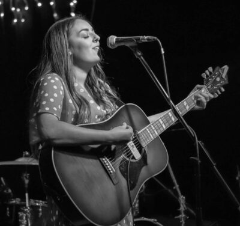
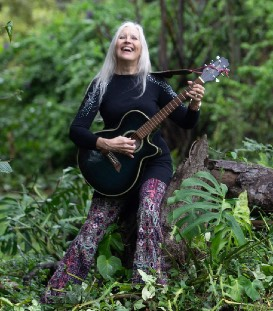
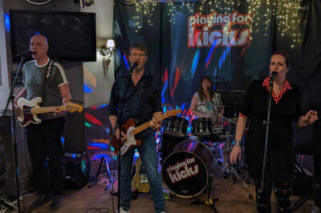
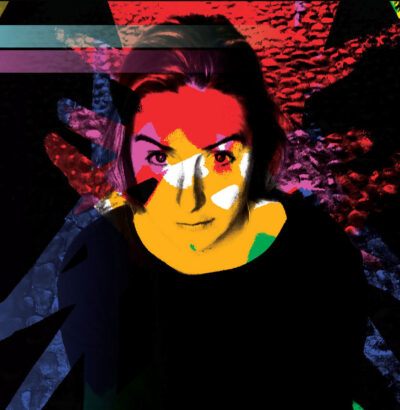
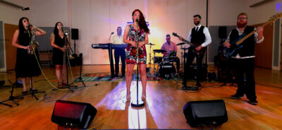
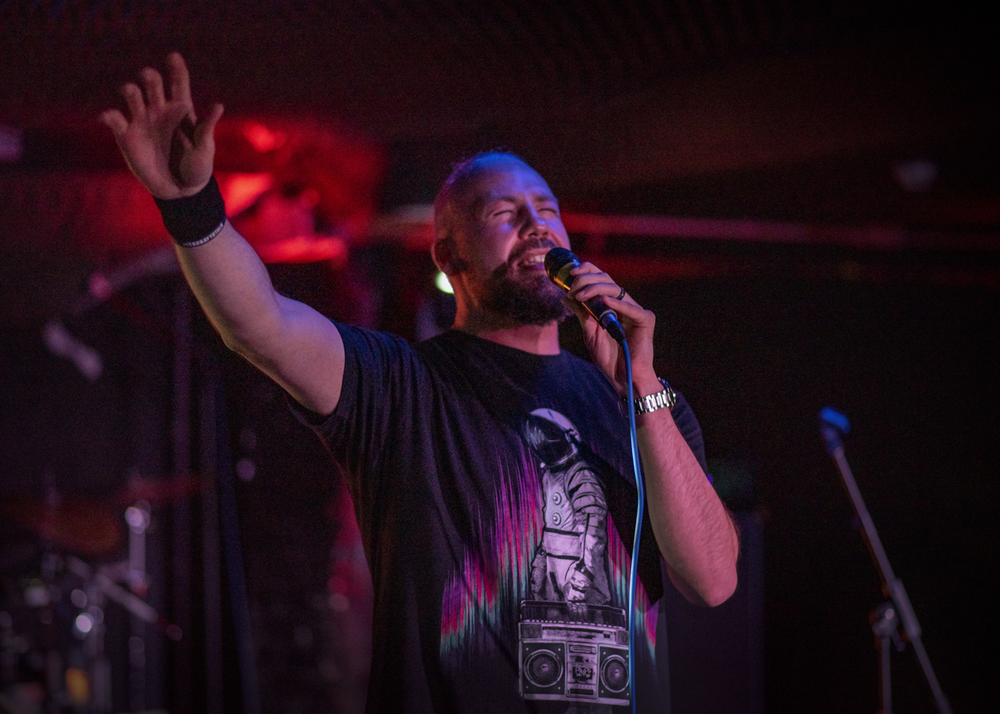

<main id="content" class="content" role="main" markdown="1">

Bingley Music Town is running the Bandstand Stage for the [Challenge Festival](https://challengefestival.co.uk/) that takes place in Myrtle Park on 25th and 26th May 2024.

# Volunteer

If you'd like to help us organise and run the event, [please get in touch](()).

# Sponsors

Thanks to all of our sponsors.



This is not-for-profit festival, but getting your band together to play still costs money, so with the help of our sponsors we're able to pay the acts something towards their costs.

We've also had some sponsorship to feed and water our volunteers over the two days.

</main>

# Bandstand Line Up

There will be music from 12 noon until 9pm on Saturday and from 12 noon until 8pm, with a new act starting every hour on the hour. The last act will be on stage at 8pm (Sat) and 7pm (Sun).

We've got 18 acts over the two days. Be sure to check back to this page for the latest details.

| Time | Saturday 25th May | Sunday 26th May |
| --- | --- | --- |
| 12 noon | [Havoc City](#havoc-city) | [Albatross](#albatross) |
| 1pm | [Nathan Harrison](#nathan-harrison) | [Bethany Gibson](#bethany-gibson) |
| 2pm | [Sabrina Piggott](#sabrina-piggott) | [Liz Narey](#liz-narey) |
| 3pm | [Fiddle n Feet](#fiddle-n-feet) | TBC |
| 4pm | [Ben Greenwell & The Spirit Guides](#ben-greenwell--the-spirit-guides) | [Alice Gilmour](#alice-gilmour) |
| 5pm | [Wilko Wilkes](#wilko-wilkes) | [Super Strut](#super-strut) |
| 6pm | [Playing For Kicks](#playing-for-kicks) | TBC |
| 7pm | [Gevaudan Dogs](#gevaudan-dogs) | [Augustin Bousfield](#augustin-bousfield) |
| 8pm | [Miriam - The First Lady of Folk](#miriam---the-first-lady-of-folk) | Event Ends |

# Bandstand Performers A-Z

## Albatross
**Sunday 12 noon**

A young, all female band.

## Alice Gilmour
**Sunday 4pm**

Expect mesmerising live violin loops, samples, and beats from local musician and sound artist, [Alice Gilmour<i class="fa fa-external-link" aria-hidden="true"></i>](https://alicegilmour.com/).

When not performing solo, Alice plays the violin in musicals for professional and amateur companies in the Yorkshire area. She also supplies violin samples and solos to all sort of projects.

 

## Augustin Bousfield
**Sunday 7pm**

[Augustin Bousfield<i class="fa fa-external-link" aria-hidden="true"></i>](https://www.augustinbousfield.com/) is a musician, composer, and producer from Bradford. He'll be bringing his own brand of wonky electro synthypop to the bandstand.

 

## Ben Greenwell & The Spirit Guides
**Saturday 4pm**

A laid back folk blues band from Riddlesden's Ben Greenwell and friends.

## Bethany Gibson
**Sunday 1pm**

Bethany's influences are Gregory Alan Isakov, Taylor Swift and Olivia Rodrigo. She writes about her own experiences with relationships and friendships to create a story for her listeners. Her strong vocals and cryptic song writing skills are what entice her audience. 

 

## Cornell Daley
**Time to be Confirmed**

Cornell is one of Bingley's great musical treasures. 

<figure class="image">
  
  <figcaption>Photo: Bingley Camera Club</figcaption>
</figure>

## Gevaudan Dogs
**Saturday 7pm**

[Gevaudan Dogs<i class="fa fa-external-link" aria-hidden="true"></i>](https://gevaudandogs.com/) is a punk rock ensemble. Brainchild of songwriter and guitarist Vince Cayo, the four-piece bring a powerhouse of energetic and impactful punk sounds similar to acts like Social Distortion, Stiff Little Fingers and The Clash.

"A punk sound that takes it all the way back to the bones of why we love it so much." – Mark Cartwright, The Punk Site

From the underground to the forefront. No apologies, no compromises – just pure punk energy live!

<figure class="image">
  
  <figcaption>Photo: Malcolm Such</figcaption>
</figure>

## Harry Speight
**Time TBC**

Young Bingley producer Harry Speight.

## Havoc City
**Saturday 12 noon**

A Young four piece band

## Liz Narey
**Sunday 2pm**

Local folk legend Liz is usually putting events for other people to sing, so it's a great treat that we'll be hearing her sing some of her own material. Expect some special guest. 

<figure class="image">
  
  <figcaption>Photo: Bingley Camera Club</figcaption>
</figure> 

## Fiddle n Feet
**Saturday 3pm**

Fiddle n Feet play traditional Appalachian dance music, and they'll have their dancers with them.
Fiddle 'n' Feet are an Appalachian dance group that is run from Bingley and rehearses in Shipley. They play traditional Appalachian dance music, and they'll have their dancers with them.

You can usually find the musicians in the Brown Cow (Monday nights) and the Chip n Ern (Wednesday nights), so if you like what you hear it's not hard to hear more!. 

## Miriam - The First Lady of Folk
**Saturday 8pm**

We're delighted that legendary folk singer from the 70s, [Miriam Backhouse<i class="fa fa-external-link" aria-hidden="true"></i>](https://www.facebook.com/MiriamBackhouseErasmus), who will be closing the day on Saturday.

Miriam became one of the most in demand folk singers of her generation with appearances on radio, TV, and at many leading Festivals including
both Cambridge and Edinburgh. 

This is the first date of her UK tour

 

## Playing For Kicks
**Saturday 6pm**

[Playing for Kicks<i class="fa fa-external-link" aria-hidden="true"></i>](https://playingforkicks.co.uk/) play songs you know and love from Tina Turner to Divine Comedy and Deacon Blue to B52’s. There’s something for everyone.

 

## Sabrina Piggott
**Saturday 2pm**

[Sabrina<i class="fa fa-external-link" aria-hidden="true"></i>](https://www.sabrinapiggott.com)'s songs are full of a sense of open spaces and possibilities; she has taken her rich traditional music background from her ancestral home in the countryside of Cork, Southern Ireland and fused it with modern industrial city sounds of her adopted
Leeds and Yorkshire.

Her distinctive rippling, almost Philip Glass evoking, acoustic guitar style sets the tone for a heart melting voice with a Celtic timbre that pulls the emotion out of the lyric. This can be heard in her debut album Roots & Wings, released in 2019.

 

## Super Strut
**Sunday 5pm**

[Super Strut<i class="fa fa-external-link" aria-hidden="true"></i>](https://www.superstrut.co.uk/) are an upbeat Funk, Soul and Disco band, with a line-up including some of Yorkshire's most exciting professional musicians. Fronted by an outstanding female vocalist, accompanied by sweet-sounding harmonies and backed by a powerful horn section, we are renowned for our energetic stage presence, feel good delivery and extraordinary musical talent. We will pack out a dance floor wherever we perform! 

 

## Wilko Wilkes
**Saturday 5pm**

A songwriter, music producer and rap workshop facilitator, [Wilko Wilkes<i class="fa fa-external-link" aria-hidden="true"></i>](https://wilkowilkes.com) is an artist on a mission to leave a positive mark on the world. His tongue-twisting tracks have gained streams and radio play worldwide. His acclaimed live set has seen him play headline gigs and open for music legends Arrested Development. 

He is also the founder of social enterprise Rap for Good, as well as a video producer, mental health advocate and community volunteer.

 

