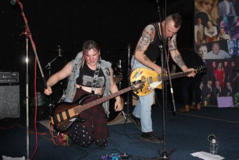
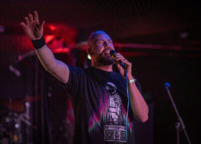

<main id="content" class="content" role="main" markdown="1">

Bingley Music Town is running the Bandstand Stage for the [Challenge Festival](https://challengefestival.co.uk/) that takes place in Myrtle Park on 25th and 26th May 2024.

# Volunteer

If you'd like to help us organise and run the event, [please get in touch](()).

# Sponsors

Thanks to all of our sponsors.



This is not-for-profit festival, but getting your band together to play still costs money, so with the help of our sponsors we're able to pay the acts something towards their costs.

We've also had some sponsorship to feed and water our volunteers over the two days.

</main>

# Bandstand Line Up

There will be music both days from 12 noon until 9pm, with a new act starting every hour on the hour. The last act will be on stage at 8pm.

We've got 18 acts over the two days. Be sure to check back to this page for the latest details.

| Time | Saturday 25th May | Sunday 26th May |
| --- | --- | --- |
| 12 noon | [Havoc City](#havoc-city) | [Albatross](#albatross) |
| 1pm | [Nathan Harrison](#nathan-harrison) | [Bethany Gibson](#bethany-gibson) |
| 2pm | [Sabrina Piggott](#sabrina-piggott) | TBC |
| 3pm | [Fiddle n Feet](#fiddle-n-feet) | [Liz Narey](#liz-narey) |
| 4pm | [Ben Greenwell & The Spirit Guides](#ben-greenwell--the-spirit-guides) | [Alice Gilmour](#alice-gilmour) |
| 5pm | [Wilko Wilkes](#wilko-wilkes) | TBC |
| 6pm | [Playing For Kicks](#playing-for-kicks) | TBC |
| 7pm | [Gevaudan Dogs](#gevaudan-dogs) |TBC |
| 8pm | [Miriam - The First Lady of Folk](#miriam---the-first-lady-of-folk) | TBC|

 
## Albatross
**Sunday 12 noon**

A young, all female band.

## Alice Gilmour
**Sunday 4pm**

Mesmerising live violin loops and beats from local musician and sound artist.

## Ben Greenwell & The Spirit Guides
**Saturday 4pm**

A laid back folk blues band from Riddlesden's Ben Greenwell and friends.

## Bethany Gibson
**Sunday 1pm**

Solo singer.

## Cornell Daley
**Time TBC**

Cornell is one of Bingley's great musical treasures. 

## Gevaudan Dogs
**Saturday 7pm**

[Gevaudan Dogs<i class="fa fa-external-link" aria-hidden="true"></i>](https://gevaudandogs.com/) is a punk rock ensemble. Brainchild of songwriter and guitarist Vince Cayo, the four-piece bring a powerhouse of energetic and impactful punk sounds similar to acts like Social Distortion, Stiff Little Fingers and The Clash.

"A punk sound that takes it all the way back to the bones of why we love it so much." – Mark Cartwright, The Punk Site

From the underground to the forefront. No apologies, no compromises – just pure punk energy live!

 

## Harry Speight
**Time TBC**

Young Bingley producer Harry Speight.

## Havoc City
**Saturday 12 noon**

A Young four piece band

## Liz Narey
**Sunday 3pm**

Local folk legend Liz is usually putting events for other people to sing, so it's a great treat that we'll be hearing her sing some of her own material. Expect some special guest. 

## Fiddle n Feet
**Saturday 3pm**

Fiddle n Feet play traditional Appalachian dance music, and they'll have their dancers with them.

## Miriam - The First Lady of Folk
**Saturday 8pm**

We're delighted that legendary folk singer from the 70s, [Miriam Backhouse<i class="fa fa-external-link" aria-hidden="true"></i>](https://www.facebook.com/MiriamBackhouseErasmus), who will be closing the day on Saturday.

Miriam became one of the most in demand folk singers of her generation with appearances on radio, TV, and at many leading Festivals including
both Cambridge and Edinburgh. 

This is the first date of her UK tour

 

## Nathan Harrison
**Saturday 1pm**

## Playing For Kicks
**Saturday 6pm**

[Playing for Kicks<i class="fa fa-external-link" aria-hidden="true"></i>](https://playingforkicks.co.uk/) play songs you know and love from Tina Turner to Divine Comedy and Deacon Blue to B52’s. There’s something for everyone.

 

## Sabrina Piggott
**Saturday 2pm**

## Wilko Wilkes
**Saturday 5pm**

A songwriter, music producer and rap workshop facilitator, [Wilko Wilkes<i class="fa fa-external-link" aria-hidden="true"></i>](https://wilkowilkes.com) is an artist on a mission to leave a positive mark on the world. His tongue-twisting tracks have gained streams and radio play worldwide. His acclaimed live set has seen him play headline gigs and open for music legends Arrested Development. 

He is also the founder of social enterprise Rap for Good, as well as a video producer, mental health advocate and community volunteer.

 

