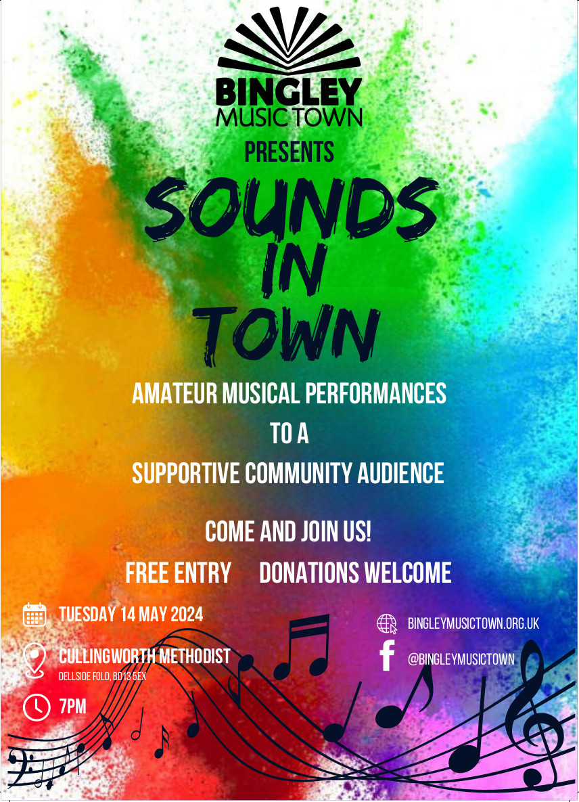

<main id="content" class="content" role="main" markdown="1">

Sounds In Town is an initiative to give local (amateur) musicians and singers of any ability the chance to perform to a sympathetic, supportive and appreciative audience. 

The events are based on the [Bradford Music Club](http://www.bradfordmusicclub.org.uk/) model where performers get a 10 minute maximum performance 'spots'. 

Each event is FREE to attend although we do ask for voluntary donations upon exit from our audience to help pay for the venue costs and to fund future events. 

The hope is that each Sounds in Town evening will have a different host/venue and we are seeking to make these quarterly events (at the least), but that will depend upon people being willing to come along and play and host! 

## Perform at Sounds in Town

If you would like to perform at Sounds In Town, please email us at ***soundsintownbingley@gmail.com.***

Tell us:
* a bit about you
* what you would like to perform
* any technical requirements
* any access needs

## Our Next Event

Plans are under way for an event on Friday 4th October 2024 in Harden. Watch this space.

## Previous Events

### May 14th 2024, Cullingworth Methodist Church

[<i class="fa-brands fa-square-facebook"></i> Facebook Event page for Sounds In Town<i class="fa fa-external-link" aria-hidden="true"></i>](https://www.facebook.com/events/1502540836969738){:target="_blank" rel="noopener noreferrer"}

Our first Sounds In Town event will took place at at [Cullingworth Methodist Church]() on 14th May 2024

Many and thanks go to Helen Richmond (MD of [Cullingworth Community Choir]()) for agreeing to host the first event.  Sounds in Town also featured her Choir as one of the performers.  

Please bring your friends, families, followers to our supportive audience.  

{:class="img-responsive"}

</main>
